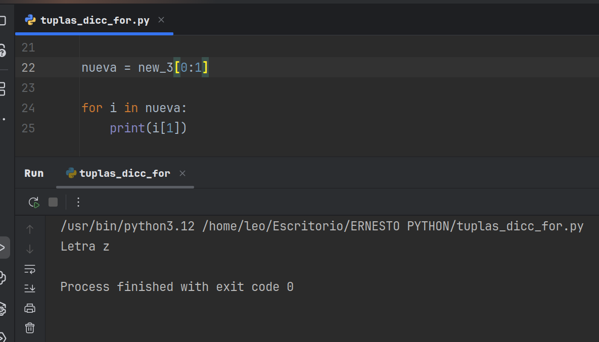

# Python: Dominio de Diccionarios con Claves de Tupla 
Este repositorio está diseñado para profesionales que buscan una comprensión concisa y directa del uso de tuplas como claves en diccionarios de Python. Este enfoque optimiza la organización y el acceso a datos complejos, una habilidad fundamental en el desarrollo de software.

## Contenido:
## El repositorio incluye un ejemplo práctico que ilustra:

## Definición de Diccionarios con Claves de Tupla:
Muestra la sintaxis y estructura para utilizar tuplas inmutables como identificadores únicos.

## Acceso Eficiente a Valores: 
Demuestra el método directo para recuperar datos asociados a claves de tupla.

## Competencia Técnica Comprobada:
Evidencia un dominio sólido de estructuras de datos esenciales en Python.

## Capacidad de Resolución de Problemas:
Refleja la habilidad para implementar soluciones precisas en el manejo de datos.

## Código Profesional:
El ejemplo presentado es claro, eficiente y mantiene los estándares de la industria.
- ## "Aqui tenemos el ejemplo del resultado cuando se ejecuta el programa:"
- 

- * **Autor: @AndresGolDev** - [**Github link:**]([https://github.com/tu-usuario](https://github.com/AndresGolDev)
